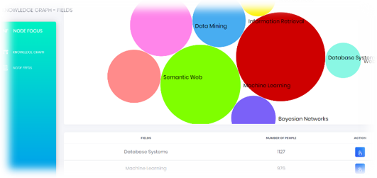
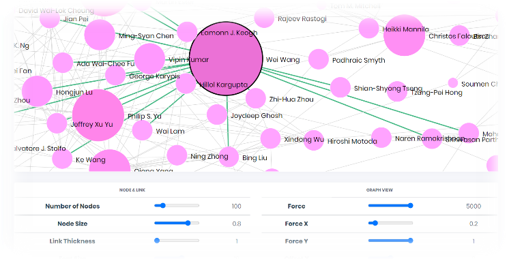
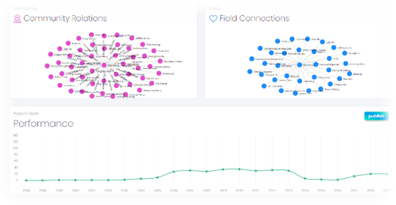
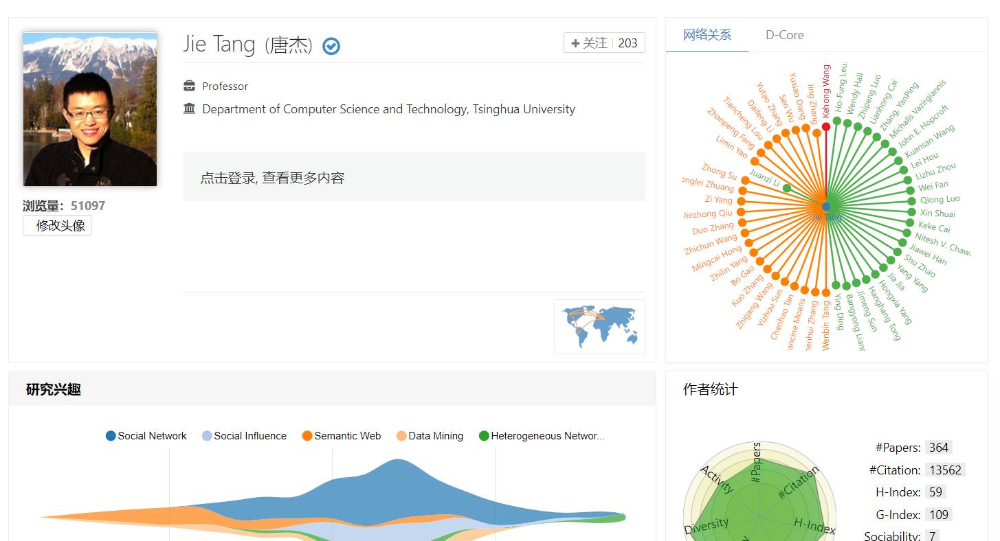
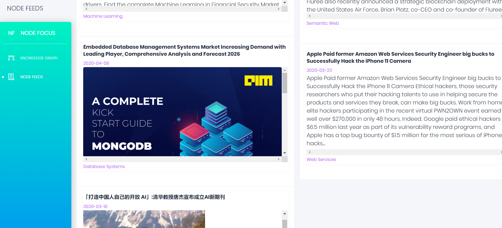

# Nodefocus
## 前言

本项目源于2020年清华大学计算机系春季唐杰老师的SOA课程，网址：http://nodefocus.tech/

分别开启前端（npm run serve）和后端（python app.py 3389）即可运行服务

如感兴趣或任何问题欢迎交流

## **NodeFocus**项目总结

* **项目初衷**

  * **从个人到整个领域**：目前的学术网站虽然具有海量的学者信息，但是主要专注于个体，没有很好的挖掘内在的领域“学术群体”信息。

  * **从学者到学者群体**：用户往往不仅想了解某个学者，还关注与其关系密切的合作者。

  * **方案**：基于领域和影响力的学者关系图谱及其可视化
  * **面向群体**：学生、研究者

* **项目功能**

  * 用户可以直观地感受到不同领域的热度对比

    

  * 借助图谱快速了解领域的知名学者、不同学者之间的影响力比较

    

  * 查看某⼀学者所在的学术群体（如：导师、学生、合作紧密的其他学者）

    

  * 借助`Aminer`外部链接了解学者更详细信息

    

  * 关注学术新闻动态

    

  * 其他功能

    * 带有异常记录功能的日志系统
    * 使用`nginx`进行负载均衡；金丝雀动态更新

* **项目技术**

  * 前端：`Vuejs + Bootstrap 4 + D3js`
  * 后端：`MongoDB + Flask`

* **服务情况**

  * 使用`ApacheBench`压力测试，平均每秒可以处理`1067.35`个请求，每个请求平均用时`93.69ms`
  * 截止目前总访问次数超过`400`次

* **项目地址**

  http://nodefocus.tech/ 预计服务至2021年4月6日 23:59

## 进一步计划

* 开放API

  我们开放了后端数据接口的`API`：

  http://123.56.73.194:3389/fields

  http://123.56.73.194:3389/fieldname/?limit      

  http://123.56.73.194:3389/person/?name

  http://123.56.73.194:3389/news/

  其具体含义描述见：

  https://git.tsinghua.edu.cn/cheng-zy17/storms/blob/dev/docs/API_convention.md

* 代码开源

  目前已经全部项目代码开源至`github`，地址为：

  https://github.com/lllizhenyu/Nodefocus
